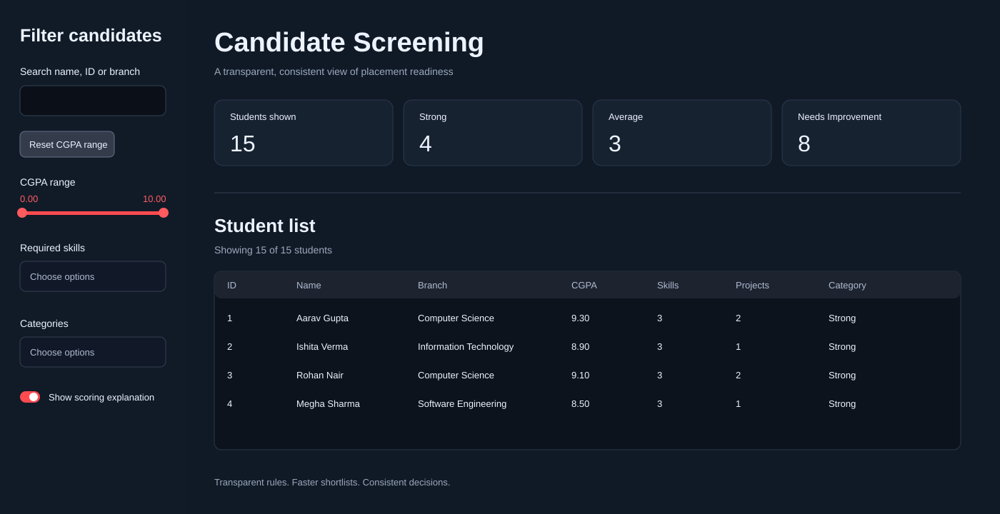

# Smart Candidate Screening System



- **Live app:** https://gamepatt78--smart-candidate-screening-system-app-1fibjl.streamlit.app/
- **GitHub repository:** https://github.com/gamepatt78/-smart-candidate-screening-system
- **Local preview:** http://127.0.0.1:8501

## About

Smart Candidate Screening System is a transparent placement tool that turns student records into fair, evidence-based shortlists. Coordinators can compare academic performance, skills, projects, internships, and certifications using shared rules and clear candidate explanations.

**Website:** https://gamepatt78--smart-candidate-screening-system-app-1fibjl.streamlit.app/

**Topics:**

- Candidate screening
- Placement management
- Student shortlisting
- Explainable scoring
- Streamlit dashboard
- Python
- Pandas

## Project overview

This project helps a placement coordinator review student profiles quickly and fairly. It reduces manual spreadsheet work by turning candidate data into a clean dashboard with scoring, filters, and clear explanations for each result.

The system is designed to be transparent and easy to trust. Instead of relying on hidden logic, it uses a simple rule-based scoring model to assess students based on academic performance, skills, projects, internships, and certifications.

## Problem statement

Manual candidate screening becomes difficult and inconsistent as the number of students grows. Two coordinators reviewing the same dataset may reach different conclusions about who is a strong candidate because there is no shared, written definition of what "strong" means. Excellent students can be overlooked when resumes are reviewed at different levels of detail, while recruitment drives often require a shortlist before there is enough time to thoroughly review every student.

The placement team needs a tool that removes this guesswork without using mysterious, black-box decisions. The rules for categorizing each student should be written clearly so a coordinator can explain a result in one sentence. The tool should also make it possible to quickly narrow the list, for example by finding students with a CGPA above 8 who know React, without manually scanning a spreadsheet.

This project addresses the problem with a deterministic scoring system, clear category thresholds, explainable results, and interactive filters.

## What the application does

- Displays all candidates in a single dashboard
- Filters by name, ID, branch, CGPA range, skills, and category
- Resets the CGPA range to the default 0.0 to 10.0 range
- Shows summary metrics for Strong, Average, and Needs Improvement candidates
- Explains why each student falls into a score category
- Supports viewing detailed student information in a compact, easy-to-read layout
- Works for both desktop and mobile screens

## Candidate scoring logic

Each student receives points using the following rules:

- CGPA: 2 points for 8.5 or above, 1 point for 7.0 to 8.49
- Skills: 2 points for 4 or more skills, 1 point for 2 to 3 skills
- Projects: 2 points for 3 or more projects, 1 point for 1 to 2 projects
- Internship experience: 2 points if present
- Certifications: 1 point if at least one certification is listed

Total score range: 0 to 9

- Strong: 7 to 9
- Average: 4 to 6
- Needs Improvement: 0 to 3

This keeps the model explainable and useful for real placement review decisions.

## How to run locally

```bash
python -m pip install -r requirements.txt
streamlit run app.py
```

The app reads the CSV file in the same folder and supports the provided student template format.

## Project structure

- app.py — main Streamlit application
- students.csv — candidate dataset
- requirements.txt — project dependencies
- README.md — project documentation

## Screenshots and product views


*Dashboard preview showing candidate filters, summary metrics, and the student list.*

The app includes:

1. Dark dashboard layout
2. Filter sidebar for search and category selection
3. Summary metric cards
4. Candidate table and expandable student detail section

The final UI is optimized for both desktop and mobile browsing.

## Technical notes

This is a deterministic, explainable screening system built with Python and Streamlit. It uses a simple scoring rule set rather than a black-box model, which makes it suitable for recruiter or placement review workflows.

## Future enhancements

- Upload a new CSV directly from the interface
- Export shortlisted candidates to CSV or PDF
- Add role-based filtering for software, data, or mechanical tracks
- Add recruiter notes and shortlisting actions
- Add authentication for team access

## Repository status

The project is pushed to the [GitHub repository](https://github.com/gamepatt78/-smart-candidate-screening-system). The application is available through the [live Streamlit deployment](https://gamepatt78--smart-candidate-screening-system-app-1fibjl.streamlit.app/). The local preview URL works only while the app is running on the development computer.
